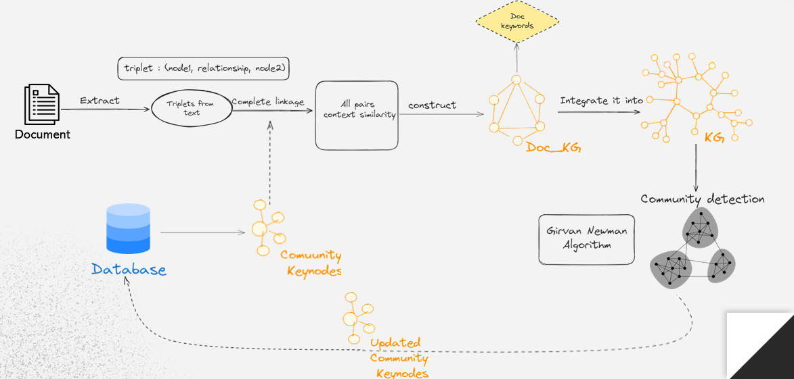
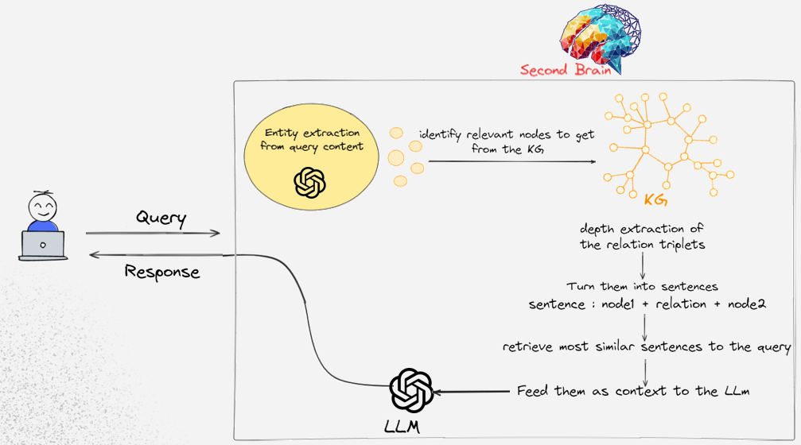

# Second Brain: Your AI-Powered Personal Knowledge Management System

## Introduction

Welcome to the GitHub repository for our AI-Powered Personal Knowledge Management System. This innovative tool empowers users to manage and interconnect their personal notes - including text, images, audio files, bookmarks, and YouTube videos - in one integrated system. Beyond mere note-taking, our system is designed to generate meaningful insights and personalized recommendations, aiding users in expanding their knowledge based on their unique interests.

### 🎥 [Demo Video](https://youtu.be/A0mS4qxtamA)

Click the link above to watch our application demo video. Experience how our system transforms personal knowledge management through its cutting-edge features.

## Features

1. **Multimedia Note Integration:** Seamlessly connect your ideas across different formats.
2. **Insightful Reflections and Recommendations:** Receive custom insights and recommendations to broaden your knowledge horizon.
3. **Knowledge Graph Construction:** Construct and refine knowledge graphs with nuanced contextual similarities.
4. **Interest Clustering:** Uncover your primary and niche interests within communities and sub-communities.
5. **Personalized Insight Generation:** Benefit from mini-KGs tailored to your interests for unique insights and suggestions.
6. **Enhanced Link Discovery:** Automatically enrich your notes with relevant web and YouTube links.
7. **Interactive Chat Functionality:** Engage with our AI in conversational mode for a dynamic learning experience.
8. **Streamlit & FastAPI Application:** Access our system through a user-friendly app designed for efficiency and ease of use.
9. **Data Privacy Assurance:** Opt for our local app solution to guarantee your data privacy, powered by the lightweight yet robust Zephyr-7b-beta.

## How it works

## Technology Stack

- **LLMs:** GPT-4, Zephyr-7b-beta
- **Application Frameworks:** Streamlit, FastAPI

## Data Privacy

- Your privacy is our top priority. Data privacy will be ensured with openai’s policy through their encryption and compliance measures.

- For full data privac, the user can run the app localy using Zephyr-7b-beta for similar performance but would require at least 16GBs in GPU.

## Contributors

* NADIF Anas ([GitHub profile](https://github.com/anasnadif), [LinkedIn profile](https://www.linkedin.com/in/anas-nadif-52064b22b/))

* EL AMRAOUI Yahya ([GitHub profile](https://github.com/Steviewondeer), [LinkedIn profile](https://www.linkedin.com/in/yahya-el-amraoui-585655279/))
